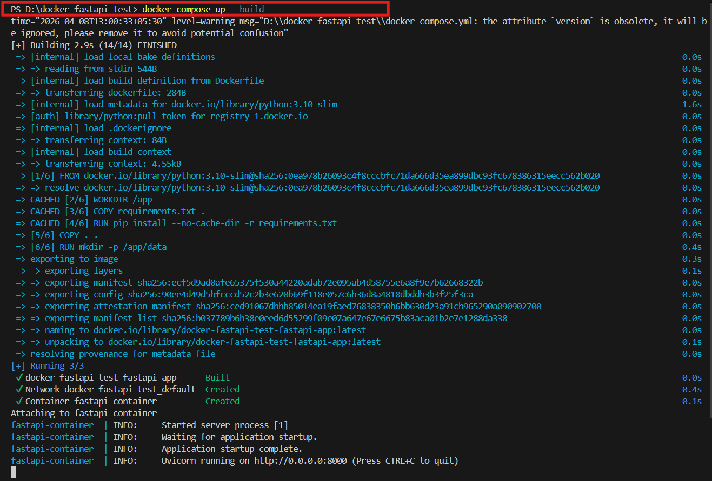
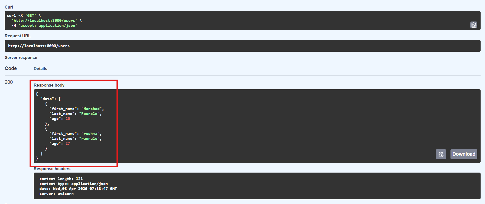
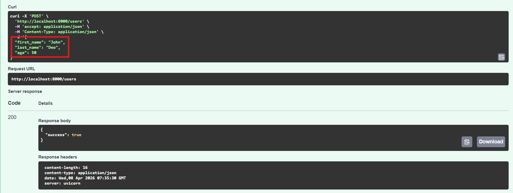
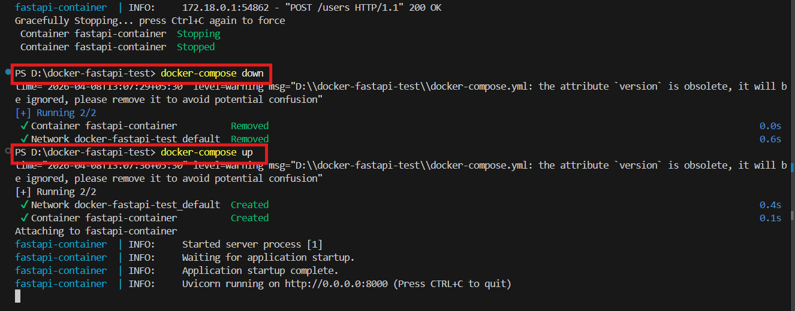
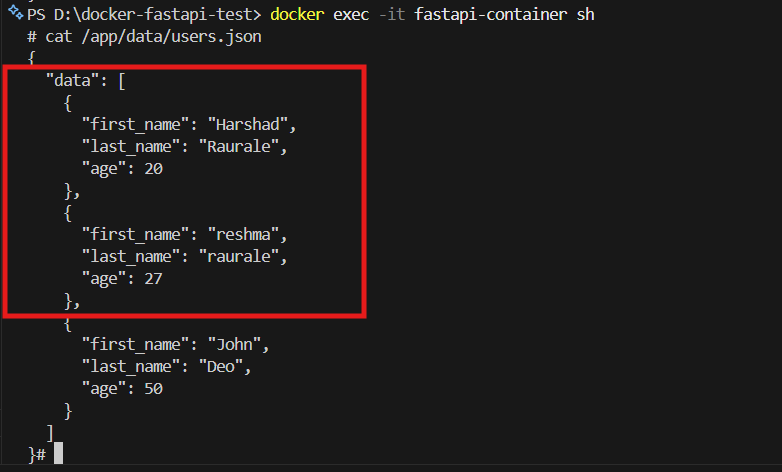

# 🚀 FastAPI Dockerized Application with Persistent Storage

## 📌 Overview
This project demonstrates how to containerize a FastAPI application using Docker and Docker Compose while ensuring data persistence using volumes and environment variables.

---

## 🧱 Project Structure

```bash
.
├── app/
│   └── main.py
├── data/
│   └── users.json   # auto-created
├── output
├── requirements.txt
├── Dockerfile
├── docker-compose.yml
└── README.md
```

---

## ⚙️ Technologies Used
- Python 3.10
- FastAPI
- Docker
- Docker Compose

---

## 🐳 Dockerfile

```dockerfile
FROM python:3.10-slim

WORKDIR /app

COPY requirements.txt .

RUN pip install --no-cache-dir -r requirements.txt

COPY . .

RUN mkdir -p /app/data

EXPOSE 8000

CMD ["uvicorn", "app.main:app", "--host", "0.0.0.0", "--port", "8000"]
```

---

## 🧩 docker-compose.yml

```yaml
version: '3.8'

services:
  fastapi-app:
    build: .
    container_name: fastapi-container
    ports:
      - "8000:8000"
    volumes:
      - ./data:/app/data
    environment:
      - DATA_DIR=/app/data
    restart: always
```

---

## 🔑 Key Concepts

### Docker
Docker containerizes the application along with all required dependencies.

### Docker Compose
Docker Compose simplifies building and running multi-container or configured containerized applications.

### Volumes (Data Persistence)

```yaml
volumes:
  - ./data:/app/data
```

This maps the local `data/` folder to the container path `/app/data`.

Because of this volume mapping, data remains available even after the container is stopped or restarted.

---

## 🌍 Environment Variables

The application uses an environment variable to define the data directory:

```python
DATA_DIR = os.getenv("DATA_DIR", "/app/data")
```

### Benefits
- Environment-independent configuration
- Works across local, Docker, and production setups
- Follows configuration best practices

---

## 📦 Data Handling
- Data is stored in `users.json`
- The file is automatically created if it does not exist
- Default structure:

```json
{
  "data": []
}
```

---

## ▶️ How to Run

### 1. Build and Start the Container

```bash
docker-compose up --build
```

> The image is built and the container starts successfully with Uvicorn running on port 8000.



---

## 🧪 API Endpoints

| Method | Endpoint | Description |
|--------|----------|-------------|
| GET | `/` | Returns hello message |
| GET | `/users` | Get all users |
| POST | `/users` | Add a new user |

### 2. Access the API Documentation

Open:

```
http://localhost:8000/docs
```

### GET `/users` — Retrieve All Users



### POST `/users` — Add a New User



---

## 🔁 Data Persistence Test

### Step 1 — Add a user via `POST /users`

### Step 2 — Stop and restart the container

```bash
docker-compose down
docker-compose up
```

> The container stops, is removed, and is recreated. Data written to the volume persists across restarts.



### Step 3 — Verify data is still present via `GET /users`

The previously added data should still be present after restart.

### Step 4 — Inspect the JSON file directly inside the container

```bash
docker exec -it fastapi-container sh
cat /app/data/users.json
```

> The `users.json` file inside the container shows all stored users including those added before the restart.



---

## 🐞 Issue Faced & Fix

### Problem
Data was not persisting after the container restart.

### Root Cause
The application was writing data to a different directory than the one mounted through the Docker volume.

### Fix
The application path was aligned with the Docker volume using an environment variable:

```python
DATA_DIR = os.getenv("DATA_DIR", "/app/data")
```

---

## 📦 .dockerignore

```dockerignore
__pycache__
*.pyc
.git
.env
```

---

## ✅ Conclusion
- Dockerized the FastAPI application
- Used Docker Compose for simplified setup
- Implemented persistent storage using volumes
- Used environment variables for flexible configuration
- Verified data persistence successfully

---

## 📬 Submission
Share the GitHub repository link.

---

## 💡 Key Takeaways
This project demonstrates core DevOps concepts such as:
- Containerization
- Orchestration
- Persistent storage
- Environment-based configuration

---

## 👨‍💻 Author

**Harshad Raurale**  
DevOps / Cloud Enthusiast

[](https://github.com/harshad8782)
[](https://www.linkedin.com/in/harshad-raurale-9a4b4826b/)